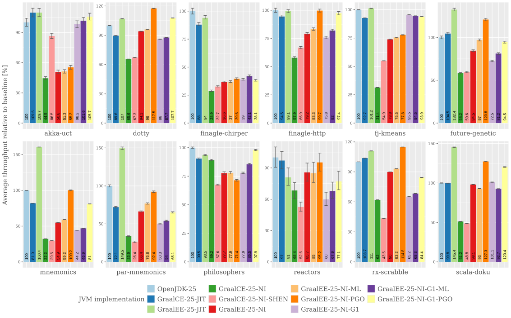

# Renaissance Benchmarks for Graal Native Image

This repository provides some scripts for running a compatible subset of the  Renaissance benchmarks as Graal native images and compares the performance of OpenJDK's HotSpot JVM with various GraalVM and GraalVM Native Image configurations.

The results for JDK 25 look as follows:

In this graph, the labels for the JVM implementation have the following meaning:
- OpenJDK-25: plain OpenJDK 25 running with the default C2/G1 configuration
- GraalCE-25-JIT: GraalVM 25 Community edition with the Graal JIT (i.e. "libgraal") running as high tier JIT and the default G1 collector.
- GraalEE-25-JIT: Oracle GraalVM 25 (formerly known as "Enterprise Edition) with the Graal JIT (i.e. "libgraal") running as high tier JIT and the default G1 collector.
- GraalCE-25-NI: Native image produced by the GraalVM 25 Community edition (running with the default Serial GC).
- GraalCE-25-NI-SHEN: Native image produced by the GraalVM 25 Community edition (running with a [development version of Shenandoah GC in "passive" (i.e. "Stop-The-World" mode)](https://github.com/simonis/labs-openjdk/tree/simonis/GR-70066)).
- GraalEE-25-NI: Native image produced by Oracle GraalVM 25 (running with the default Serial GC and without automatic, ML-powered, profile guided optimizations (PGO), i.e. `-H:-MLProfileInference`).
- GraalEE-25-NI-ML: Native image produced by Oracle GraalVM 25 (running with the default Serial GC and automatic, ML-powered, profile guided optimizations (PGO)).
- GraalEE-25-NI-PGO: Native image produced by Oracle GraalVM 25 (running with the default Serial GC and explicit, profile guided optimizations (PGO), i.e. training run).
- GraalEE-25-NI-G1: Native image produced by Oracle GraalVM 25 (running with G1 GC and without automatic, ML-powered, profile guided optimizations (PGO), i.e. `-H:-MLProfileInference`).
- GraalEE-25-NI-G1-ML: Native image produced by Oracle GraalVM 25 (running with G1 GC and automatic, ML-powered, profile guided optimizations (PGO)).
- GraalEE-25-NI-G1-PGO: Native image produced by Oracle GraalVM 25 (running with the G1 GC and explicit, profile guided optimizations (PGO), i.e. training run).

The above numbers were collected on a [c5.metal](https://costcalc.cloudoptimo.com/aws-pricing-calculator/ec2/c5.metal) bare metal instance with 96 vCPUs and 25gb RAM using [Renaissance 0.16.1](https://renaissance.dev/download).

## Details on running the benchmarks

Graal actually has built-in (i.e. into `mx`) support for running the Renaissance benchmarks and only [excludes "chi-square", "gauss-mix", "page-rank" and "movie-lens"](https://github.com/oracle/graal/blob/70b9a98abc80bbdc54145dd84edfbfe94b6e836b/sdk/mx.sdk/mx_sdk_benchmark.py#L3878-L3882) from the full benchmark set. There's also special support for building native images versions of the benchmarks in [mx_substratevm_benchmark.py](https://github.com/oracle/graal/blob/a14af8cc6a27c4138083dfb28db5b6c2b5a9d881/substratevm/mx.substratevm/mx_substratevm_benchmark.py#L69-L148). Unfortunately, this support seems to be broken for a few more benchmarks. According to current information (i.e. Feb. 12, 2026) from the [Graal Native Image Slack channel](https://graalvm.slack.com/archives/CN9KSFB40/p1770839392854859) the following Renaissance benchmarks are known to currently work with Native Image: "akka-uct", "dotty", "finagle-chirper", "finagle-http", "fj-kmeans", "future-genetic", "mnemonics", "par-mnemonics", "philosophers", "reactors", "rx-scrabble", "scala-doku", "scala-kmeans", "scala-stm-bench7", "scrabble". These are the benchmarks further considered here.

[Renaissance 0.14](https://renaissance.dev/2022/01/31/renaissance-0-14-0.html) introduced the so called "[*standalone mode*](https://renaissance.dev/posts#standalone-mode)" which executes a benchmark without the help of the launcher in the main Renaissance bundle. The benchmark harness is still used, but both the harness and benchmark code are loaded using a single class loader. The benchmark bundle (i.e. ` renaissance-gpl-0.16.1.jar`) needs to be manually extracted. In addition to directories containing the benchmark and dependency jars, it also contains metadata-only jars (one for each benchmark) in a directory called `single/`. These jars can be used to execute the corresponding benchmark in standalone mode simply by running `java -jar single/<benchmakr>.jar` or to create a native image for them with `native-image -o <benchmark>.exe -cp single/<benchmakr>.jar org.renaissance.harness.RenaissanceSuite` which can then be executed as `<benchmark>.exe <benchmark>`,

The script [./scripts/renaissanceNI.sh](./scripts/renaissanceNI.sh) handles this automatically. For HotSpot execution it just runs the benchmarks as described above. For the native image case it first runs each benchmark on HotSpot with the native image agent in order to collect the required reachability metadata and then created the native image version of each benchmarks. For the profile guided optimizations modes (PGO) it adds another intermediate step to first create an instrumented native image and run it in order to collect the PGO data which is then used in the final build step of the actual native image.

The script can be configured with environment variables, many of which are mandatory and will let the script fail if not defined:

Name | Mandatory | Default | Description
:--- | :-------: | :-----: | :----------
`OPENJDK_HOME` | &check; | &cross; | Directory where to find a plain OpenJDK distribution |
`GRAALCE_HOME` | &check; | &cross; | Directory where to find a plain Graal CE distribution |
`GRAALCE_SHEN_HOME` | &check; | &cross; | Directory where to find a plain Graal CE distribution with [Shenandoah support](https://github.com/simonis/labs-openjdk/tree/simonis/GR-70066) |
`SHENANDOAH_HOME` | &check; | &cross; | Directory where to find [`libshenandoahgc-ur.so`](https://github.com/simonis/labs-openjdk/tree/simonis/GR-70066) |
`GRAALEE_HOME` | &check; | &cross; | Directory where to find an Oracle Graal distribution |
`RENAISSANCE_SINGLE` | &check; | &cross; | The `single/` subdirectory of an unpacked Renaissaince benchmark `.jar` file |
`OUTPUT` | &cross; | `RenaissanceNI/output` | Directory where to place the artifacts produced by the script.  |

## Creating the output graphs
